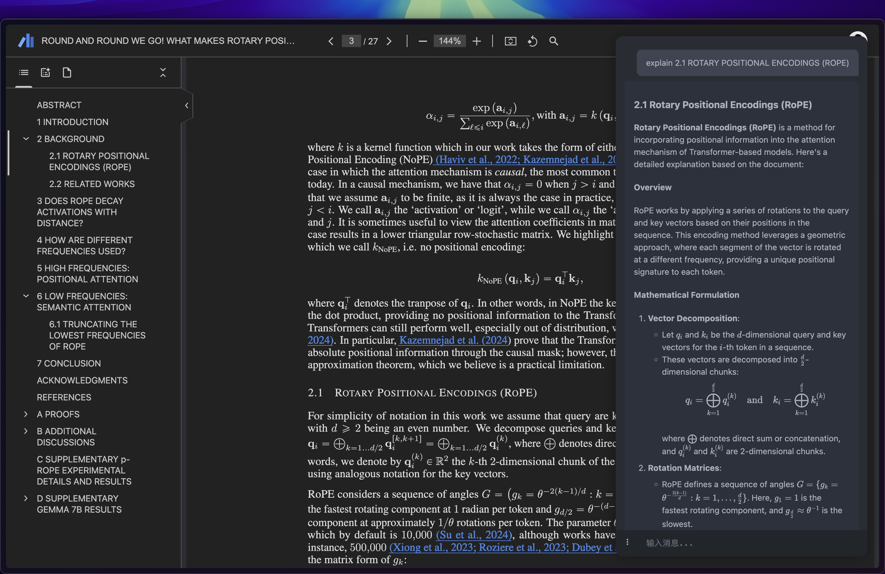

<p align="center">

</p>

<p align="center">
<a href="https://chromewebstore.google.com/detail/cerebr/kjojanemcpiamhohkcpcddpkbnciojkj">
    
</a>
<a href="https://microsoftedge.microsoft.com/addons/detail/cerebr/gafelkdahhgmlccdmpnohckjfkmcdlfe">
    
</a>
<a href="https://addons.mozilla.org/en-US/firefox/addon/cerebr/">
    
</a>
  <a href="https://t.me/uni_api">
    
  </a>
</p>

[English](./README.md) | [Simplified Chinese](./README_CN.md)

# 🧠 Cerebr - Intelligent AI Assistant



The name "Cerebr" comes from a Latin root related to "brain" or "cerebrum". This etymology reflects our vision: to integrate powerful AI capabilities from Claude, OpenAI, and others, making Cerebr your second brain for deep reading and understanding. Cerebr is a powerful browser AI assistant extension, available for Chrome, Firefox, and Edge, focused on enhancing your work efficiency and learning experience.

Born from a need for a clean, efficient browser AI assistant, Cerebr stands out with its minimalist design and powerful features. While other solutions often come with limitations or cluttered interfaces, Cerebr focuses on delivering a seamless, distraction-free experience for your web browsing needs.

## ✨ Core Features

- 🎯 **Smart Sidebar** - Quick access via hotkey (Windows: `Alt+Z` / Mac: `Ctrl+Z`) to chat with AI anytime, anywhere
- 🔄 **Multiple API Support** - Configure multiple APIs to flexibly switch between different AI assistants
- 🔁 **Config Sync** - Cross-browser API configuration synchronization for seamless device switching
- 💻 **Multi-Platform Support** - Available for Chrome, Firefox, and Edge, bringing a consistent experience across browsers.
- 📝 **Comprehensive Q&A** - Support webpage content Q&A, PDF document Q&A, image Q&A and more
- 🎨 **Elegant Rendering** - Perfect support for Markdown text rendering and LaTeX math formula display
- ⚡ **Real-time Response** - Stream output for instant AI replies
- ⏹️ **Flexible Control** - Support stopping generation at any time, sending new messages will stop the current generation
- 🌓 **Theme Switching** - Support light/dark themes to protect your eyes
- 🌐 **Web Version** - Support web version, no installation required, accessable from any browser, support vercel, GitHub Pages and cloudflare pages deployment

## 🛠️ Technical Features

- 💾 **State Persistence** - Automatically save chat history, sidebar status, etc.
- 🔄 **Config Sync** - Cross-device configuration sharing through browser's native sync API
- 🔍 **Smart Extraction** - Automatically identify and extract webpage/PDF content
- ⌨️ **Shortcut Operations** - Support hotkey to clear chat (Windows: `Alt+X` / Mac: `Ctrl+X`), up/down keys for quick history recall
- 🔒 **Secure & Reliable** - Support multiple API key management with local data storage
- 🎭 **High Compatibility** - Officially supports Chrome, Firefox, and Edge, adapting to various webpage environments.

## 🎮 User Guide

1. 🔑 **Configure API**
   - Click the settings button
   - Fill in API Key, Base URL and model name
   - Support adding multiple API configurations

2. 💬 **Start Chatting**
   - Use hotkey Windows: `Alt+Z` / Mac: `Ctrl+Z` to summon sidebar
   - Input questions and send
   - Support image upload for visual Q&A

3. 📚 **Webpage/PDF Q&A**
   - Enable webpage Q&A switch
   - Automatically identify and extract current page content
   - Support intelligent PDF file Q&A

## 💡 Tips & Shortcuts

- ↔️ **Resize Sidebar** - Drag the sidebar’s left edge to resize; double-click the edge to reset to default width
- ⌨️ **Send Message** - `Enter` to send, `Shift+Enter` for a new line, `Esc` to blur the input
- ⬆️⬇️ **Recall Previous Questions** - When the input is empty, press `↑`/`↓` to cycle through your recent questions; press `↓` at the newest item to return to an empty input
- 📋 **Context Menu** - Right-click a message (or long-press on touch devices) for copy/regenerate/delete; `Esc` to close
- 🖼️ **Image Preview** - Click an image to preview; press `Esc` or click outside to close

## 🔧 Advanced Features

- 📋 **Right-click Copy** - Support right-click to directly copy message text
- 🔄 **History Records** - Use up/down arrow keys to quickly recall historical questions
- ⏹️ **Stop Generation** - Show stop button when generating messages, can stop generation at any time
- 🖼️ **Image Preview** - Click images to view full size
- ⚙️ **Custom Settings** - Support customizing hotkeys, themes and more

## 🚀 Web Version Deploy

1. You can quickly deploy the web version of Cerebr to Fugue with one click:

[](https://fugue.pro/new/repository?repository-url=https%3A%2F%2Fgithub.com%2Fyym68686%2Fcerebr)

2. You can quickly deploy the web version of Cerebr to Vercel with one click:

[](https://vercel.com/new/clone?repository-url=https%3A%2F%2Fgithub.com%2Fyym68686%2Fcerebr)

3. You can deploy to Cloudflare Pages:

2.1 After registering a Cloudflare account, apply for a Workers API TOKEN.

After entering the Cloudflare homepage, select "Profile" in the upper right corner -> "My Profile" -> "API Tokens" -> "Create Token" -> "Edit Cloudflare Workers" -> You can choose the permissions for "Account Resources" and "Zone Resources" by yourself -> Continue to summary -> Create Token -> Save the token (**Note:** Save your token properly as it will only be displayed once).

2.2 Return to the homepage, find "Workers" on the left -> Open "Workers & Pages" -> Click "Create" -> "Pages" -> "Import an existing Git repository" -> Find the forked repository -> Begin setup.

2.3 Enter a name you like for the project, and in the "Build command" field, input:

`bash scripts/prepare_pages_site.sh pages-site`

2.4 In the "Build output directory" field, input:

`pages-site`

2.5 No additional environment variables are required for the standard Git-connected Pages deployment flow.

2.6 Save and deploy.

4. You can also deploy to GitHub Pages:

```bash
# Fork this repository
# Then go to your repository's Settings -> Pages
# In the "Build and deployment" section:
# - Select "Deploy from a branch" as Source
# - Choose your branch (main/master) and root (/) folder
# - Click Save
```

The deployment will be automatically handled by GitHub Actions. You can access your site at `https://<your-username>.github.io/cerebr`

### Web Version Features
- 🌐 Access Cerebr from any browser without installation
- 💻 Same powerful features as the Chrome extension
- ☁️ Deploy your own instance for better control
- 🔒 Secure and private deployment

## 📦 Desktop Application

After installing the dmg file, you need to execute the following command:

```bash
sudo xattr -r -d com.apple.quarantine /Applications/Cerebr.app
```

This project uses Pake to pack the dmg file, the command is as follows:

```bash
iconutil -c icns icon.iconset
pake https://xxx/ --name Cerebr --hide-title-bar --icon ./icon.icns
```

https://github.com/tw93/Pake

## 🚀 Latest Updates

- 🆕 Added image Q&A functionality
- 🔄 Optimized webpage content extraction algorithm
- 🐛 Fixed math formula rendering issues
- ⚡ Improved overall performance and stability

## 📝 Development Notes

This project is developed using Chrome Extension Manifest V3, with main tech stack:

- 🎨 Native JavaScript + CSS
- 📦 Chrome Extension API
- 🔧 PDF.js + KaTeX + Marked.js

## 🤝 Contribution Guide

Issues are welcome for discussion. To reduce maintenance cost, this project does not accept any feature PRs (new/improved features); please discuss feature requests in Issues. PRs are only accepted for bug fixes.

Before submitting a bug-fix PR, please ensure:

- 🔍 You have searched related issues
- ✅ Follow existing code style
- 📝 Provide clear description and reproduction steps

## 📄 License

This project is licensed under the GPLv3 License
