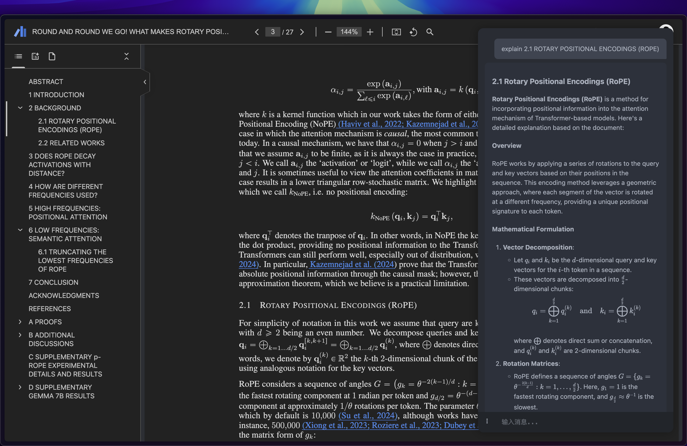

<p align="center">

</p>

<p align="center">
<a href="https://chromewebstore.google.com/detail/cerebr/kjojanemcpiamhohkcpcddpkbnciojkj">
    
</a>
</p>

[English](./README.md) | [简体中文](./README_CN.md)

# 🧠 Cerebr - 智能 AI 助手



Cerebr 是一款强大的 Chrome 浏览器 AI 助手扩展,专注于提升您的工作效率和学习体验。"Cerebr"源自拉丁语词根，与"大脑"或"脑"相关。这个命名体现了我们的愿景：整合 Claude、OpenAI 等 AI 的强大能力，使 Cerebr 成为您的第二大脑，为您提供深度阅读和理解支持。

在尝试了市面上现有的浏览器 AI 助手后，我们发现它们要么有使用次数限制，要么界面过于花哨。Cerebr 应运而生，专注于提供一个简洁、高效、无干扰的 AI 助手体验。

## ✨ 核心特性

- 🎯 **智能侧边栏** - 通过快捷键(Windows: `Alt+Z` / Mac: `Ctrl+Z`)快速唤出,随时随地与 AI 对话
- 🔄 **多 API 支持** - 支持配置多个 API,灵活切换不同的 AI 助手
- 🔁 **配置同步** - 支持跨浏览器的 API 配置同步，轻松在不同设备间共享设置
- 📝 **全能问答** - 支持网页内容问答、PDF 文档问答、图片问答等多种场景
- 🎨 **优雅渲染** - 完美支持 Markdown 文本渲染、LaTeX 数学公式显示
- ⚡ **实时响应** - 采用流式输出,即时获取 AI 回复
- ⏹️ **灵活控制** - 支持在生成过程中随时停止，发送新消息自动停止当前生成
- 🌓 **主题切换** - 支持浅色/深色主题,呵护您的眼睛
- 🌐 **网页版** - 支持网页版，无需安装，通过任何浏览器访问，支持 vercel、GitHub Pages 和 cloudflare pages 部署

## 🛠️ 技术特性

- 💾 **状态持久化** - 自动保存对话历史、侧边栏状态等
- 🔄 **配置同步** - 支持通过浏览器原生同步API实现跨设备配置共享
- 🔍 **智能提取** - 自动识别并提取网页/PDF 内容
- ⌨️ **快捷操作** - 支持快捷键清空聊天(Windows: `Alt+X` / Mac: `Ctrl+X`)、上下键快速调用历史问题
- 🔒 **安全可靠** - 支持多 API Key 管理,数据本地存储
- 🎭 **兼容性强** - 支持主流浏览器,适配各类网页环境

## 🎮 使用指南

1. 🔑 **配置 API**
   - 点击设置按钮
   - 填写 API Key、Base URL 和模型名称
   - 支持添加多个 API 配置

2. 💬 **开始对话**
   - 使用快捷键 Windows: `Alt+Z` / Mac: `Ctrl+Z` 唤出侧边栏
   - 输入问题并发送
   - 支持图片上传进行图像问答

3. 📚 **网页/PDF 问答**
   - 开启网页问答开关
   - 自动识别并提取当前页面内容
   - 支持 PDF 文件智能问答

## 🔧 高级功能

- 📋 **右键复制** - 支持右键直接复制消息文本
- 🔄 **历史记录** - 使用上下方向键快速调用历史问题
- ⏹️ **停止生成** - 在生成消息时右键显示停止按钮，可随时中断生成
- 🖼️ **图片预览** - 点击图片可查看大图
- ⚙️ **自定义配置** - 支持自定义快捷键、主题等设置

## 🚀 网页版部署

1. 你可以一键将 Cerebr 的 Web 版本部署到 Vercel：

[](https://vercel.com/new/clone?repository-url=https%3A%2F%2Fgithub.com%2Fyym68686%2Fcerebr)

2. 你可以部署到 Cloudflare Pages：

```bash
# 安装 Wrangler CLI
npm install -g wrangler

# 登录 Cloudflare
wrangler login

# 部署到 Cloudflare Pages（带 SSL 配置）
wrangler pages deploy . --project-name cerebr --branch main
```

3. 你也可以部署到 GitHub Pages：

```bash
# Fork 这个仓库
# 然后进入你的仓库的 Settings -> Pages
# 在"构建和部署"部分：
# - 将"Source"选择为"Deploy from a branch"
# - 选择你的分支（main/master）和根目录（/）
# - 点击保存
```

部署将由 GitHub Actions 自动处理。你可以通过 `https://<你的用户名>.github.io/cerebr` 访问你的站点

### Web 版本特点
- 🌐 无需安装，通过任何浏览器访问
- 💻 与 Chrome 扩展版本具有相同的强大功能
- ☁️ 部署自己的实例以获得更好的控制
- 🔒 安全私密的部署方案

## mac 桌面应用

安装 dmg 后，需要执行以下命令：

```bash
sudo xattr -r -d com.apple.quarantine /Applications/Cerebr.app
```

本项目使用 Pake 打包，打包命令如下：

```bash
iconutil -c icns icon.iconset
pake https://xxx/ --name Cerebr --hide-title-bar --icon ./icon.icns
```

https://github.com/tw93/Pake

## 🚀 最新更新

- 🆕 支持图片问答功能
- 🔄 优化网页内容提取算法
- 🐛 修复数学公式渲染问题
- ⚡ 提升整体性能和稳定性

## 📝 开发说明

本项目采用 Chrome Extension Manifest V3 开发,主要技术栈:

- 🎨 原生 JavaScript + CSS
- 📦 Chrome Extension API
- 🔧 PDF.js + KaTeX + Marked.js

## 🤝 贡献指南

欢迎提交 Issue 和 Pull Request 来帮助改进项目。在提交之前,请确保:

- 🔍 已经搜索过相关的 Issue
- ✅ 遵循现有的代码风格
- 📝 提供清晰的描述和复现步骤

## 📄 许可证

本项目采用 GPLv3 许可证